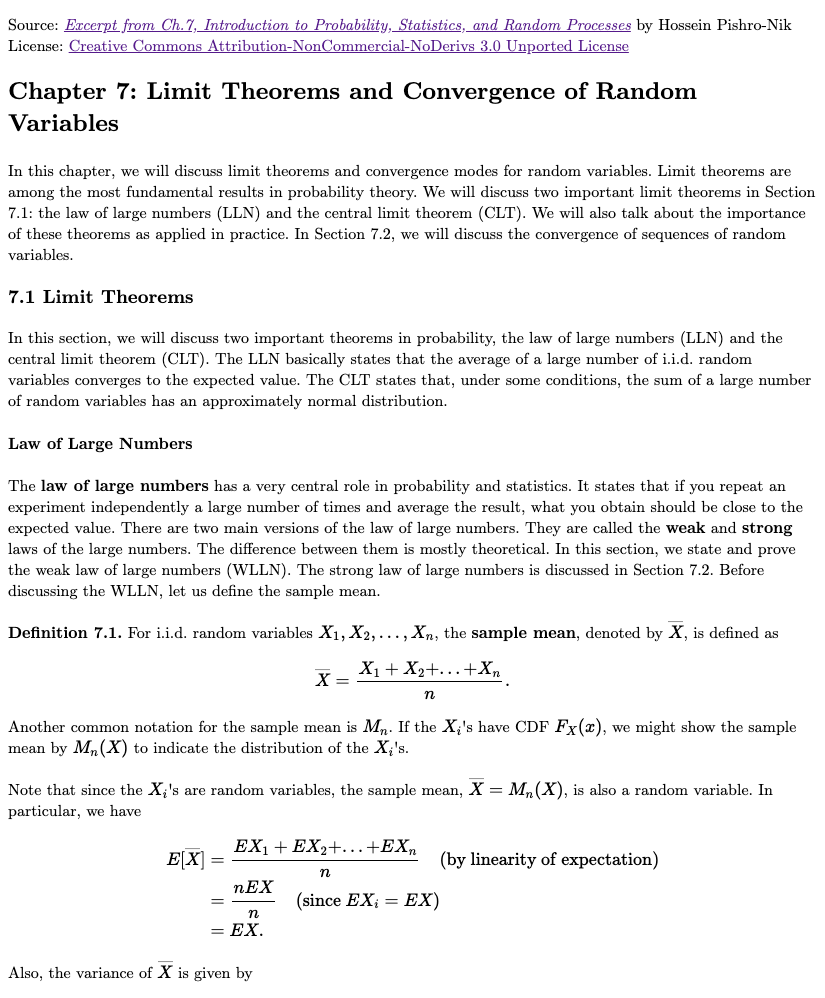
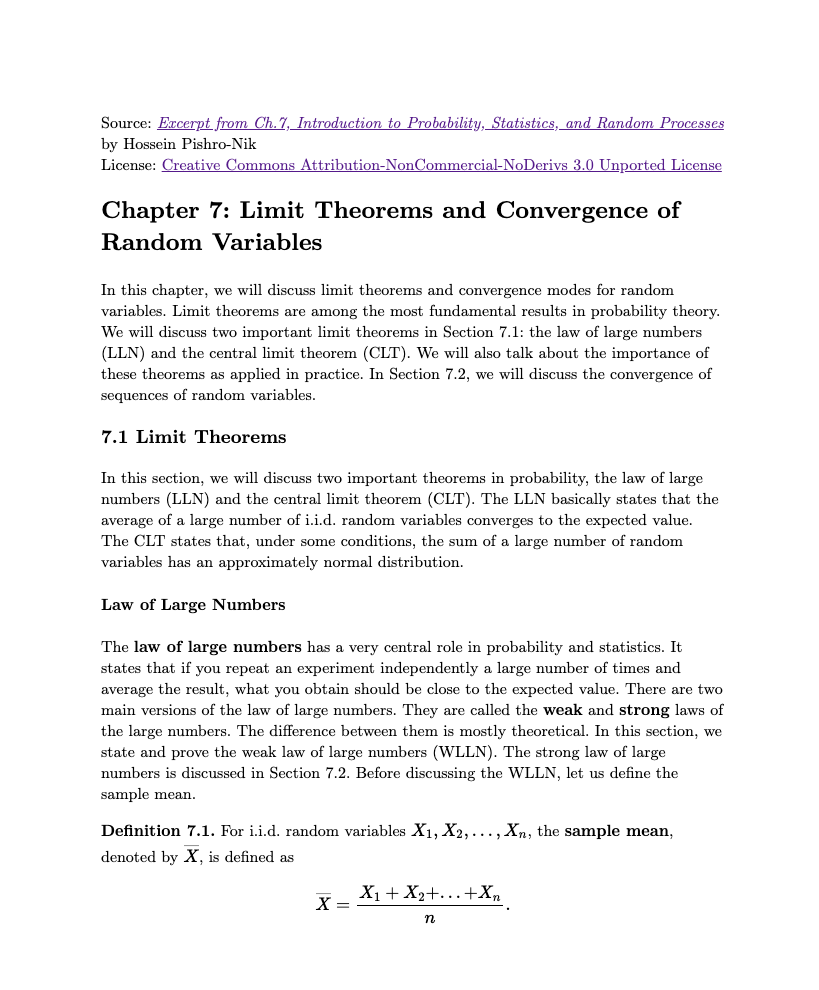

## A Markdown editor with LaTeX fonts

##### (An exercise developing JavaScript application with [sketch](https://www.github.com/kcf-jackson/sketch))

Three distinctive features of the editor are:

1. it uses LaTeX fonts by default;
2. it supports vimium-like hotkey hints (enabled with the left Meta key);
3. it allows fast HTML/PDF-preview.

The editor is suitable for taking short LaTeX notes. Try it out [here](https://gitcdn.xyz/repo/kcf-jackson/markdown-latex-font/master/math_editor_v2/math_editor_v2.html). (Use the globe button to load a file from URL and the pdf button to toggle HTML/PDF view.)

---

### Screenshot

#### Vimium-like hotkey hints

#### HTML vs PDF view

HTML view             |  PDF view
:-------------------------:|:-------------------------:
  | 

---

### Reference

1. The editor is the [Ace editor](https://ace.c9.io/).

2. HTML-view is generated by [marked.js](https://marked.js.org/)

3. PDF-view is generated by [Paged.js](https://www.pagedjs.org/)
